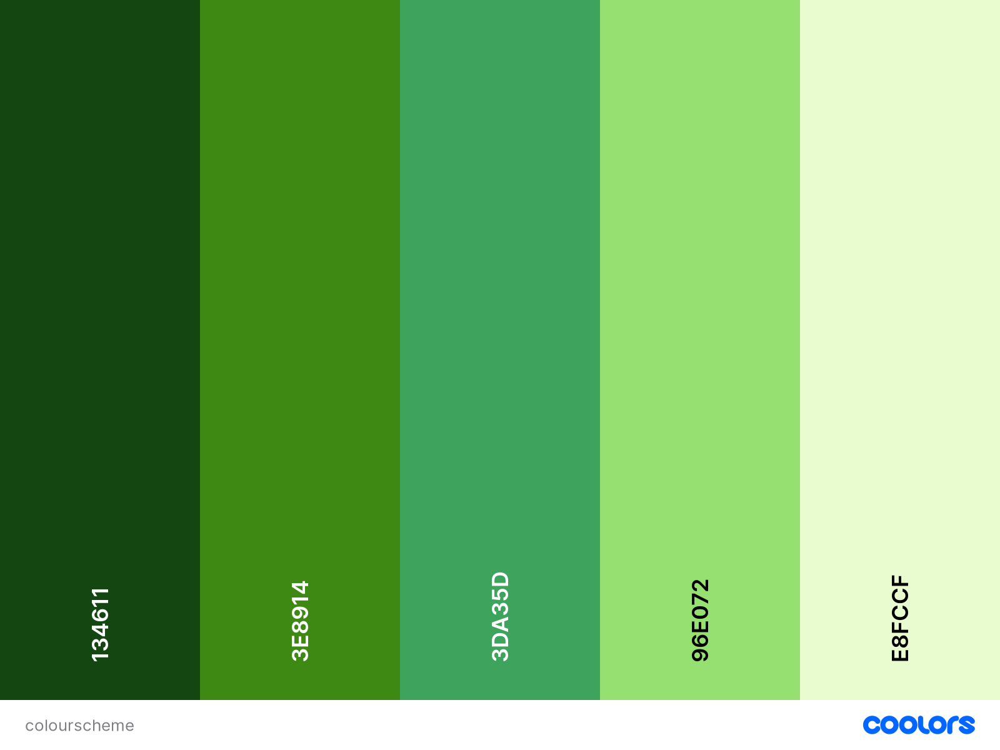
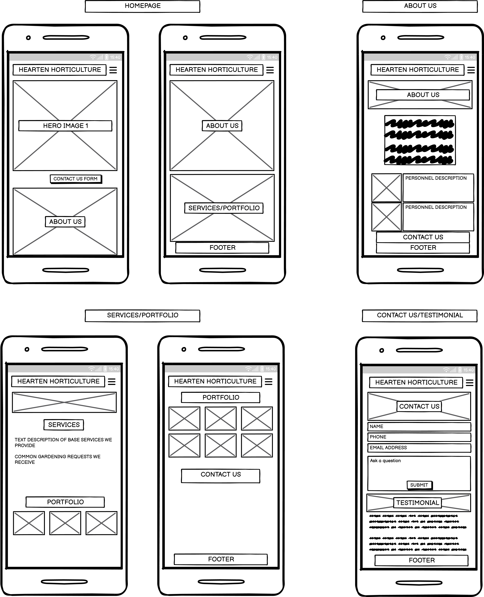
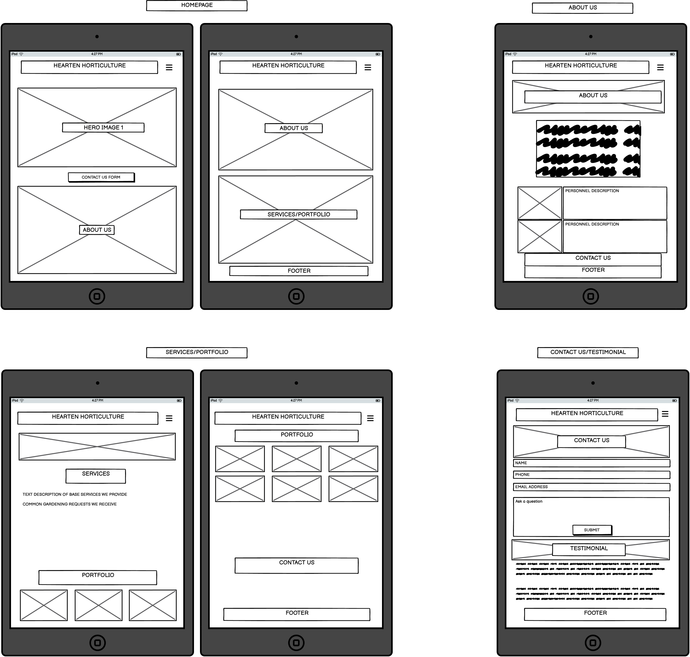
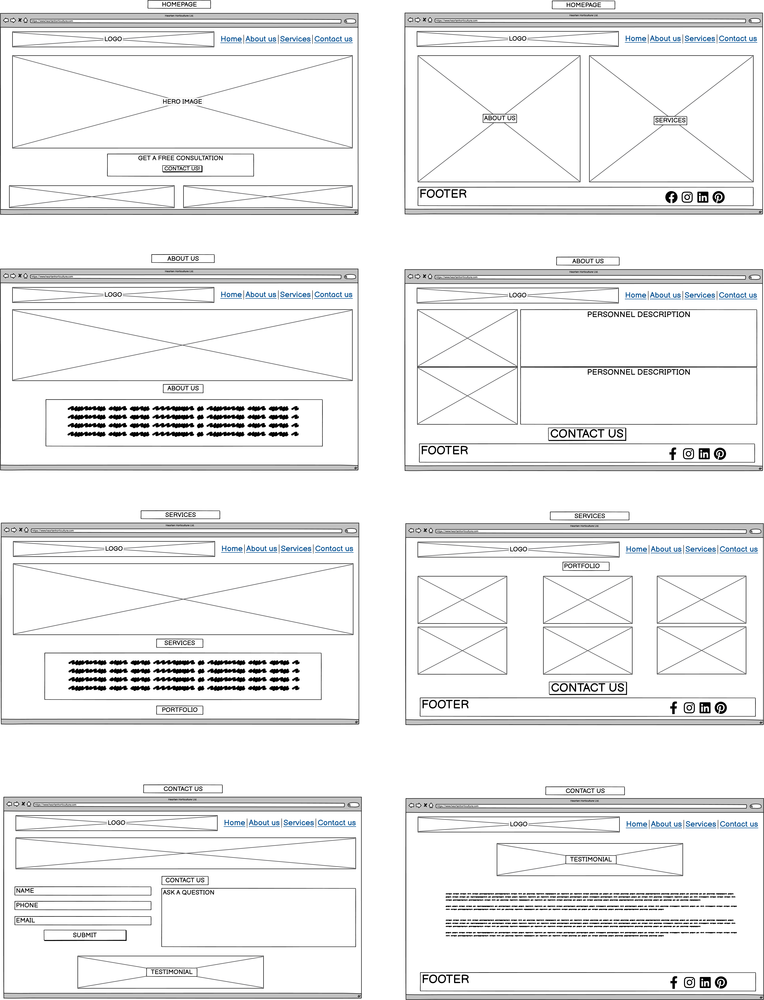

# Hearten Horticulture – Gardening Business Website

This responsive site is designed for people to learn more about Hearten Horticulture Ltd and can be viewed on various devices.

[View Hearten Horticulture on Github Pages](https://rhysbobbett.github.io/heartenhorticulture/)

### About the site
It features a simple opening page with a navbar that includes a button to go straight to a mailing list/contact us form. The about page information shows the company aims and how they do it, providing some brief marketing information. The services and portfolio page displays the works offered by the business and examples of previous projects carried out. There is a contact page to submit questions or enquiries.
This website was designed to be simple as the target audience is primarily elderly people and those unable to care for their gardens, so user functionality is a must. The aim is to get the user to register their email address for the newsletter and contact us for services to be carried out if they live in the local area. There should be assurance that users will interact with the page in some way be it through the question form or viewing the portfolio.

## Website Goals

### Business Goals

-   Ease of use for elderly people, easy to navigate.
-   An easy contact process for anyone to use, and to register for a mailing list.
-   Interesting enough to click through all the webpages.
-   Promote business products and services through locality checking.
-   Use the page to advertise products as a web-shop or through referral links.

### Customer Goals

-   Find a gardening service suitable for their needs.
-   To be able to find any information about gardening or plants.
-   To see benefits to signing up to the newsletter or receiving the local services.

## User Experience

### Potential Customers

-   Mainly adults interested in gardening but it should be suitable for all ages.
-   Possible to place paid advertisements or product referrals.
-   Clients contacting for advice rather than in-person services.
-   Elderly clients should find the website easy to use, with high visibility for links and navigation.
-   Establishments looking to run gardening-based workshops.

### User Stories

## New User:
-   I want to know what the site is for.
-   I want to be able to explore everything the site has to offer easily.
-   I want to see services on offer immediately.
-   If I have questions, I should be able to get them answered through a contact system.

## Returning User:
-   I want to come back to the site often to see if there are any new articles.
-   I want to return to the site for informative references.
-   I want to see social media from the source before anyone else.

## Other customer scenarios:
-   I’m a potential customer who wants some testimony before signing up.
-   I’m a potential customer who wants to know how much these services are and what is available.

## Site Adminstrator:
-   As a site administrator, the pages should be easily manageable
-   As a site administrator, the contact system should be able to sort general enquiries into categories to ensure that it reaches the correct knowledge base.
-   As a site administrator, the code should be signposted and easy to navigate, it should be consistent and accurate, so I can update it when required.

## Design

### Colour Scheme

The site features the following colours:
- Forest Green Traditional: #134611;
- India Green: #3E8914;
- Green Pigment: #3DA35D;
- Light Green: #96E072;
- Nyanza: #E8FCCF;

The colours were selected for their often associated use within the gardening industry with the exception of Nyanza, an off-green/yellow which will be used for contrast. 

*The website [Coolors](http://www.coolors.co) has been used here to preview the colour scheme and how they look together as a palette.*

### Font Family

The main logo of the site is in [‘Barlow Condensed’](https://fonts.google.com/specimen/Barlow+Condensed?query=barlow&preview.text=HEARTEN%20HORTICULTURE&preview.text_type=custom), a very clear and readable font. The websites fonts will be linked from [Google Fonts](https://fonts.google.com/). Most of the website will use some variation of this font styled in various ways, such as italic and bold. They will be weighted between 300 and 500. The fallback font will be sans-serif.

## Images

All images used are gardening or plant related. The images will be all consistent in style and colours to fit in with the website’s themes. The homepage image should be bright and inviting, and feature real-world examples of the garden business’ work portfolio.

## Wireframes

The wireframing software [Balsamiq Wireframes](https://balsamiq.com/wireframes/) has been used to produce wireframe drawings and to preview the site’s layout.

### Mobile

*Mobile Wireframe layout*
 
### Tablet

*Tablet Wireframe layout*
 
### Desktop

*Desktop Wireframe layout*

## Features

### Common features on all pages

The site will have a responsive navigation bar at the top of the page, anchored to the top of the page while you scroll. The navigation bar has links for Home, About us, Contact us. The links are then compacted for mobile devices and tablets as a drop-down menu. The page you are currently on will be highlighted 
All social media links are included within the footer alongside a privacy policy statement,
All the themes of the pages will be consistent, such as colour, font and layout.
Clicking the main logo will always bring you back to the homepage.
The footer will contain social media links for facebook, twitter, Instagram and Youtube.

### Home Page

The main page is simply a hero image with a brief text explaining what the site is.
The links on the navigation bar are big enough that they can be noticed easily by those with visual impairments. 
The homepage establishes the feel of the site and should be very easy to navigate.

### About Us

This page will feature text explaining the business ethos, alongside images of personnel with brief description of their related experiences. The page will also feature a 'Contact us' button below this information to quickly bring users to the 'Contact Us' page.

### Services and Portfolio

This page will feature a table of services offered that will scroll to a media gallery of images showing previous works carried out.

### Contact us page

This page will have a form with multiple options, for information regarding the business itself or to enquire about a garden consultation. There will be a few sections to fill out to ensure that the queries are being directly to the relevant people. The form will require a name, email and/or contact phone number. 
Briefly details the sorts of questions that are commonly asked. 
Signup to a mailing list.
About Us Page
The about us page will act as a key personnel page within the business, alongside our company aims, ambitions and future ideas.

### Future Features
-   Using Javascript, it should be possible to make the background images change during both the time of day, or which season we are currently in.
-   Javascript based timetable to inform customers of the flowers, fruit and vegetables that can be grown on that given day. A feature of this could be      utilise IP data to provide a local weather update through a 3rd party API.
-   A feature page where the top search trending plants are listed as a 'top 10' and where to buy them at their cheapest.

## Languages and resources

- [HTML5](https://html.spec.whatwg.org/multipage/) – Markup language which makes up the content of the site.
- [CSS3](https://www.w3.org/TR/css-2022/) – Used to style the majority of the site
- [Bootstrap v5.3.0](https://getbootstrap.com/) – Open-source framework for mobile-first frontend development.
- [FontAwesome](https://fontawesome.com/) – linked for all icons used on the site.
- [Google Fonts](https://fonts.google.com/) – Source of the site’s fonts.
- [Balsamiq Wireframes](https://balsamiq.com/wireframes/) – Software used to wireframe and prototype the site’s look and layout.
- [Github](https://github.com/) – Repository for the site’s code.
- [Gitpod](https://www.gitpod.io) – IDE used to write the site.

## Testing
### Bugs
Issue : Upon deployment to Github pages, my logo image was failing to load.
Solution : This was fixed by changing the URL to navigate from the parent directory. This was solved by reading through the CSS documentation 

Issue : When deploying to Github using the animated image png files in the CSS, the URL again failed to load correctly.
Solution : formatting the folder as '../assets/images/filename.jpeg' allows github to correctly find the parent folder allowing images to load correctly.

Issue : The 'Contact us!' button upon the homepage would not be visible when the background was moving.
Solution : Using Z-index in the CSS, the layers can be sorted by their visibility order, and numbered accordingly, the order was corrected to suit the page requirements. This method was applied to allow images to be placed on top of other images on the index.html page.

Issue: This was an aesthetic issue, but having the links in the top right corner didn't provide the accessibility of placing them adjacent to the logo in a user's line of sight when looking at a desktop screen.
Solution: Adjust design to accomodate centering the link navigation bar onscreen.

## Deployment
I deployed the website to Github pages for testing purposes. The site was deployed by following instructions found in the Github docs page.
I navigated to my site's repository, selected 'Settings', then 'Code and Automation' section, navigated to 'Pages', then 'Source' to select the main branch of the repository, upon clicking 'Save', the repository was deployed.

## Credits

Browsing on www.codepen.io has shown me a few things related to colour changing transitions with the @keyframes rule, used to create CSS animations using the CSS animation property. I have been inspired by the site relating to changing colours of text as an animation to use in my links and scrolling backgrounds. Credits to https://codepen.io/vailjoy for the lesson at (https://codepen.io/vailjoy/pen/KaqNMM) on changing colour of backgrounds, and credits to Henry Gilson https://codepen.io/henryedg on the scrolling background image lesson https://codepen.io/henryedg/pen/zYzzXON
Thanks to these lessons, I have been able to understand some features of the animation property in CSS.

### Content
* The font 'Barlow Condensed' comes from [Google Fonts](https://fonts.google.com/)
* Instructions relating to creating a clickable image comes from [w3 Schools](https://www.w3schools.com/), specifically a section of using images in HTML and a subsection called [Images as a link](https://www.w3schools.com/html/html_images.asp)
* Instructions relating to Github deployment come from Github's docs pages [Github Docs](https://docs.github.com/en)
* Icons in the footer come from [Font Awesome](https://fontawesome.com/icons)

### Media
* The main logo was created in Adobe Illustrator by myself 
* All photographs, images and designs on the site I have either photographed, drawn or created by myself. The background images and banner images were created using [Stable Diffusion](https://github.com/Stability-AI/stablediffusion) which utilises [Python](https://github.com/python) and the [PyTorch](https://github.com/pytorch/pytorch) framework to create machine learning images. I trained the engine with additional images of gardens and plants I have photographed myself. 

