# Testing

I have carried out testing to fix bugs and validated the HTML and CSS of each page, results shown below.

## Issues during development

Firstly, I will go over basic problems and issues I encountered when coding the site.

- Issue : Upon deployment to Github pages, my logo image was failing to load.
Solution : This was fixed by changing the URL to navigate from the parent directory. This was solved by reading through the CSS documentation 

- Issue : When deploying to Github using the animated image png files in the CSS, the URL again failed to load correctly.
Solution : formatting the folder as `../assets/images/filename.jpeg` allows github to correctly find the parent folder allowing images to load correctly.

- Issue : The 'Contact us!' button upon the homepage would not be visible when the background was moving.
Solution : Using Z-index in the CSS, the layers can be sorted by their visibility order, and numbered accordingly, the order was corrected to suit the page requirements. This method was applied to allow images to be placed on top of other images on the index.html page.

- Issue: This was an aesthetic issue, but having the links in the top right corner didn't provide the accessibility of placing them adjacent to the logo in a user's line of sight when looking at a desktop screen.
Solution: Adjust design to accomodate centering the link navigation bar onscreen.

- Issue: Toggle of my burger button was not initiating the dropdown menu.
Solution: I had been using a slightly outdated version of bootstrap, I added the updated CDN links to the head of my pages and it now works.

- Issue: Content overlaps with footer on services page.
Solution: Adjust image size using the CSS vh variable and create a container to act as a heading banner. Change the class to that of bootstrap's 'container-fluid' in the correct divs on the page.

- Issue: The navbar doesn't compress properly when viewing on larger devices such as a tablet.
Solution : I changed the navbar bootstrap from large to Xl (lg to xl) so when viewed on any device other than a desktop, the navbar would be condensed.

## Code Validation

### HTML
| File | Screenshot | Passed / Notes |
| --- | --- | --- |
Homepage - index.html |  | Yes - no errors |
About us / bio page - about.html | | Yes - no errors|
Services / Portfolio - services.html |  | Yes - no errors |
Contact us - contactus.html |  | Yes - no errors |
Response page - response.html |  | Yes - no errors |
404 page - 404.html |  | Yes - no errors |

### CSS

| Filename | Screenshot | Notes |
| --- | --- | --- |
style.css |  | The style.css gave no errors, but when using the direct url to validate, bootstrap and fontawesome will produce errors. |

## Browser Compatibility

I have tested the site on various desktop and mobile browsers, results below:
| Browser | Screenshot | Notes |
| --- | --- | --- |
[Google Chrome](https://www.google.com/chrome) | | No issues or errors on any page |
[Mozilla Firefox Developer Edition](https://www.mozilla.org/en-GB/firefox/developer/) | | No issues or errors on any page  |
[Microsoft Edge ](https://www.microsoft.com/en-gb/edge) | | No issues or errors on any page  |

## Accessibility testing
I tested the accesibility levels of the site using the [WAVE Web Accessibility Evaluation Tool](https://wave.webaim.org/)
The Alerts in the images are based on the tool deciding if something should be a heading where I didn't require it.
Here is a table of results for each page:
| Page | Screenshot | Pass / Notes |
| --- | --- | --- |
Index.html |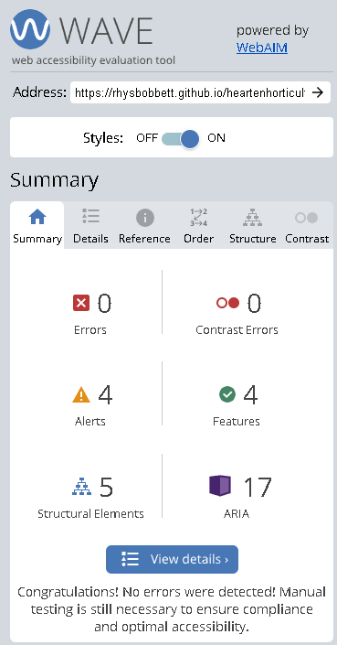 | No errors |
about.html |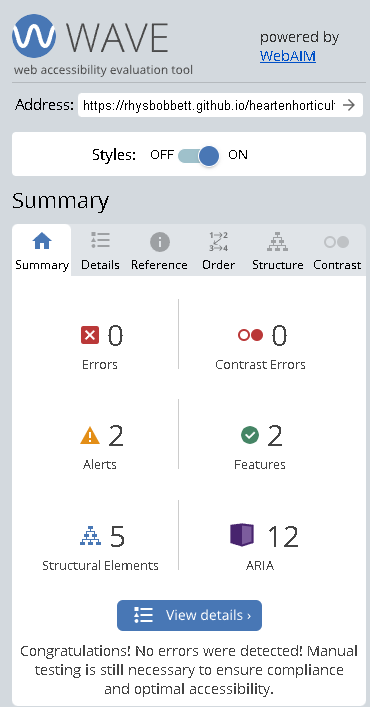 | No errors |
services.html | | No errors |
contactus.html |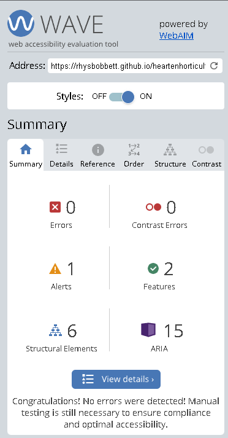 | No errors |
response.html |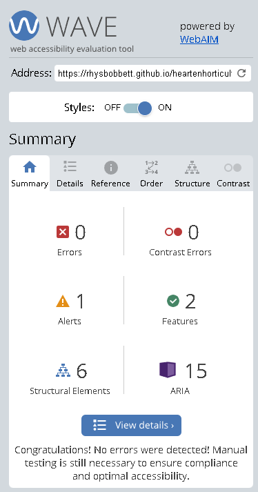 | No errors |
404.html | | No errors |

## Lighthouse testing

### Accesibility Audit 
Using Chrome's Lighthouse developer tools, I was able to get a good accesibility score on each of my website's pages.
I have had to darken some fonts that were originally going to be lighter shades of green, this was to reach a minimum rating of 4 for contrast visibility. The colour scheme I have used is still co-ordinated using my original palette but some colours have been swapped around on certain stand-alone blocks of text and changed slightly from the original specified colours to allow for features such as the active page in the navbar to be seen as active, the active link bootstrap property changes the text to black. Results are shown in the tables below.

### Perfomance
I was able to check the site's performance and optimise it for different criteria.
The criteria used in Lighthouse are Performance, Best Practices, Accessibility, Search Engine Optimisation and Progressive Web App.
The category of Progressive Web App is not met by any page as it doesn't meet the criteria. All results are shown in the tables below.
 
During testing, I was able to amend my code to maximise the categories, my making sure all links are crawlable on the pages, I was able to achieve maximum rating for SEO for nearly all pages.

Page | Screenshot | Format | Results / Notes
| --- | --- | --- | --- |
index.html |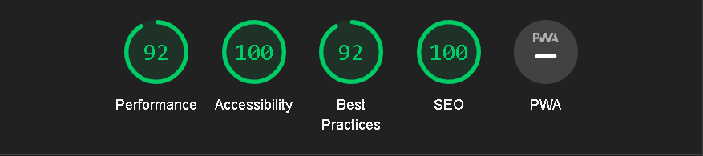 | Desktop | Pass, changing the logo and background image resolution would increase the performance of the page |
index.html | | Mobile | Pass, same as previous issue on desktop, the image could be too large to get a perfect score in performance speed. |
| | | |
about.html | | Desktop | Pass, my logo doesn't fit criteria of a standard aspect ratio, so this is marked down for Best Practice |
about.html |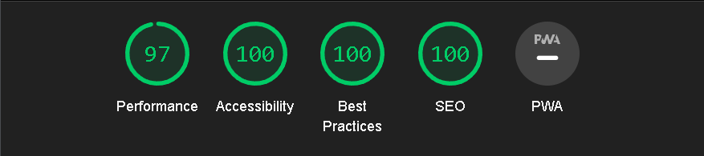 | Mobile | Pass, scoring slightly higher than desktop in Best Practice I believe is due to the variable ratios of mobile devices, performace slightly lower again due to the vector graphic logo |
| | | |
services.html |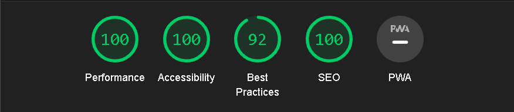 | Desktop | Pass, my logo doesn't fit criteria of a standard aspect ratio, so this is marked down on Best Practice |
services.html | | Mobile | Pass, the performance could be improved by resizing the image resolution in the portfolio gallery before upload. |
| | | |
contactus.html |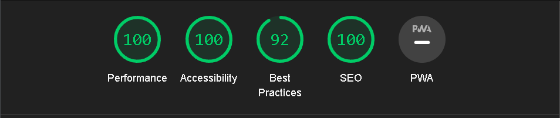 | Desktop | Pass, The mark of 92 for Best Practice relates to my logo being a non-standard aspect ratio  |
contactus.html |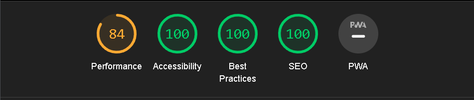 | Mobile | Pass, The low performace score refers to recomended use of render-blocking resources using javascript to defer loading certain parts of the page  |
| | | |
response.html |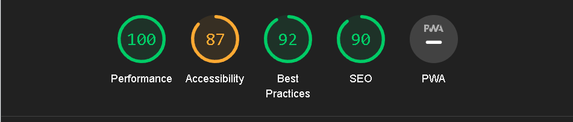 | Desktop | Pass, for all categories but accessibilty, as lighthouse suggests an automatic refresh after 10 seconds is unexpected and may create a confusing experience. I believe this is perfectly acceptable as there is no further functionality required of the user after seeing the submission response, they would instinctively navigate back to the homepage at their own accord if the feature was not implemented. |
response.html |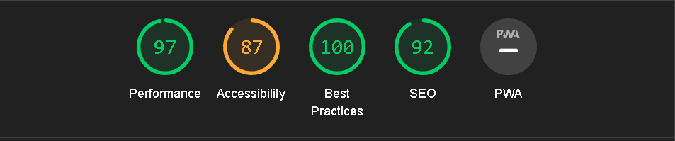 | Mobile | Pass, the large image brings the score of performace down. The same accessibility score as desktop is due to the automatic refresh.  |
| | | |
404.html |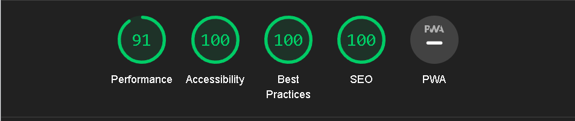 | Desktop | Pass, the large background needs the resolution to be changed if the page is to reach maximum performace score |
404.html | | Mobile | Pass, the large background needs the resolution to be changed if the page is to reach maximum performace score, it functions faster than desktop due to the width of the image not loading as intended.  |
| | | |

# Testing

## Responsiveness

I tested the site on a variety of devices, I used google chrome's developer tools and a few actual devices to test the layout.

### Device

 iPhone 12 Pro (Dev Tools)

| Page | Result |
| --- | --- |
| Home | :heavy_check_mark: |
| About | :heavy_check_mark: |
| Services | :heavy_check_mark: |
| Contact us | :heavy_check_mark: |
| Response | :heavy_check_mark: |
| 404 | :heavy_check_mark: |

Samsung Galaxy S20 Ultra (Dev Tools)

| Page | Result |
| --- | --- |
| Home | :heavy_check_mark: |
| About | :heavy_check_mark: |
| Services | :heavy_check_mark: |
| Contact us | :heavy_check_mark: |
| Response | :heavy_check_mark: |
| 404 | :heavy_check_mark: |

iPad Air (Dev Tools)

| Page | Result |
| --- | --- |
| Home | :heavy_check_mark: |
| About | :heavy_check_mark: |
| Services | :heavy_check_mark: |
| Contact us | :heavy_check_mark: |
| Response | :heavy_check_mark: |
| 404 | :heavy_check_mark: |

Surface Duo (Dev Tools)

| Page | Result | 
| --- | --- |
| Home | :heavy_check_mark: |
| About | :heavy_check_mark: |
| Services | :heavy_check_mark: |
| Contact us | :heavy_check_mark: |
| Response | :heavy_check_mark: |
| 404 | :heavy_check_mark: |

Surface Duo (Tested on a friend's device)

| Page | Result |
| --- | --- |
| Home | :heavy_check_mark: |
| About | :heavy_check_mark: |
| Services | :heavy_check_mark: |
| Contact us | :heavy_check_mark: |
| Response | :heavy_check_mark: |
| 404 | :heavy_check_mark: |

Nest Hub Max (Dev Tools)

| Page | Result |
| --- | --- |
| Home | :heavy_check_mark: |
| About | :heavy_check_mark: |
| Services | :heavy_check_mark: |
| Contact us | :heavy_check_mark: |
| Response | :heavy_check_mark: |
| 404 | :heavy_check_mark: |

Huiwei Y6 (Tested on a friend's device)

| Page | Result |
| --- | --- |
| Home | :heavy_check_mark: |
| About | :heavy_check_mark: |
| Services | :heavy_check_mark: |
| Contact us | :heavy_check_mark: |
| Response | :heavy_check_mark: |
| 404 | :heavy_check_mark: |

Samsung Galaxy Note 10 (actual device)

| Page | Result |
| --- | --- |
| Home | :heavy_check_mark: |
| About | :heavy_check_mark: |
| Services | :heavy_check_mark: |
| Contact us | :heavy_check_mark: |
| Response | :heavy_check_mark: |
| 404 | :heavy_check_mark: |

## Testing - User Stories

### New User:
User story | Site functionality | Screenshot/Notes
| --- | --- | --- |
I want to know what the site is for | The site's about page is one the first items a user would see on the homepage, directing them to a small bio about the company owners. |   |
I want to be able to explore everything the site has to offer easily. | The site is only 4 pages, all easily accessible from the top sticky navbar |   |
I want to see services on offer immediately. | The services page has many services listed as the main content |   |
If I have questions, I should be able to get them answered through a contact system. | The contact page is reachable from both a banner button on the homepage and the top navbar |   |

### Returning User:
User story | Site functionality | Screenshot/Notes
| --- | --- | --- |
I want to come back to the site often to see if there are any new articles. | Future developement of the site will have a blog page, this has not been implemented at the moment, the existing gallery is easily updated by an admin providing the user is informed that the site has been updated | There will be development of a wiki style plant directory in time to allow frequent visits to the site| 
I want to return to the site for informative references. | The services page is easily updatable as the owner can decide on any services to add or remove to this page throughout the year as seasons change. | There is a plan for the wiki style plant directory, this may develop into an e-commerce platform. | 
I want to see social media from the source before anyone else. | The footer contains some up-to-date social media links, and the page features images not shown on social media as a feature of exclusivity |  | 

### Other customer scenarios:
User story | Site functionality | Screenshot/Notes
| --- | --- | --- |
I’m a potential customer who wants some testimony before signing up. | There is currently no mailing list system to sign up to, but this is to be looked at in the future development of the site. | We are to assume the contact system will build a database of inquiry email address to use as a mailing list, this should be easy to unsubscribe should a user require it |
I’m a potential customer who wants to know how much these services are and what is available. | The services page has some examples of services carried out and are clearly shown, the user is suggested to use the contact system to make inquiries. | As actual prices are currently fluctuating so much, it would be unwise to post prices on the site, inquiries are therefore encouraged.|

### Site Adminstrator:
User story | Site functionality | Screenshot/Notes
| --- | --- | --- |
As a site administrator, the pages should be easily manageable | The html is labelled accordingly, and each gallery item is labelled to easily locate for future updates. |  |
As a site administrator, the contact system should be able to sort general enquiries into categories to ensure that it reaches the correct knowledge base. | In future development of the site, I plan for a dropdown menu with seperate categories to apply a sorting filter to incoming messages. | This is a feature I will implement in the future to sort which categories of inquiry we receive. |
As a site administrator, the code should be signposted and easy to navigate, it should be consistent and accurate, so I can update it when required. | The code is highly signposted and consistent, easiliy updated and easy to manage. | The code is labelled accordingly and should be simple to update any page in the future |
As a site administrator, I would expect forms to be filled as required | The contact form must be filled with valid information or errors appear to the user |  |

## Remaining bugs

All features on the website work as intended, the user stories align with the website's current functionality, with some features requiring further development.

As I'm not currently utilising any JS or python scripts on the page, there are no remaining bugs that I am aware of.