# Testing

I have carried out testing to fix bugs and validated the HTML and CSS of each page, results shown below.

## Bugs

Firstly, I will go over basic problems I bugs and issues I encountered when coding the site.

Issue : Upon deployment to Github pages, my logo image was failing to load.
Solution : This was fixed by changing the URL to navigate from the parent directory. This was solved by reading through the CSS documentation 

Issue : When deploying to Github using the animated image png files in the CSS, the URL again failed to load correctly.
Solution : formatting the folder as '../assets/images/filename.jpeg' allows github to correctly find the parent folder allowing images to load correctly.

Issue : The 'Contact us!' button upon the homepage would not be visible when the background was moving.
Solution : Using Z-index in the CSS, the layers can be sorted by their visibility order, and numbered accordingly, the order was corrected to suit the page requirements. This method was applied to allow images to be placed on top of other images on the index.html page.

Issue: This was an aesthetic issue, but having the links in the top right corner didn't provide the accessibility of placing them adjacent to the logo in a user's line of sight when looking at a desktop screen.
Solution: Adjust design to accomodate centering the link navigation bar onscreen.

Issue: Toggle of my burger button was not initiating the dropdown menu.
Solution: I had been using a slightly outdated version of bootstrap, I added the updated CDN links to the head of my pages and it now works.

Issue: Content overlaps with footer on services page.
Solution: Adjust image size using the CSS vh variable and create a container to act as a heading banner. Change the class to that of bootstrap's 'container-fluid' in the correct divs on the page.

## Accesibility Audit 
Using Chrome's Lighthouse developer tools, I was able to get a good accesibility score on each of my website's pages.
I have had to darken some fonts that were originally going to be lighter shades of green, this was to reach a minimum rating of 4 for contrast visibility. The colour scheme I have used is still co-ordinated using my original palette but some colours have been swapped around on certain stand-alone blocks of text and changed slightly from the original specified colours to allow for features such as the active page in the navbar to be seen as active, the active link bootstrap property changes the text to black.

## Code Validation

### HTML
| File | Screenshot | Passed / Notes |
| --- | --- | --- |
Homepage - index.html |  | Yes - no errors |
About us / bio page - about.html | | Yes - no errors|
Services / Portfolio - services.html |  | Yes - no errors |
Contact us - contactus.html |  | Yes - no errors |

### CSS

| Filename | Screenshot | Notes |
| --- | --- | --- |
style.css |  | The style.css gave no errors, but when using the direct url to validate, bootstrap and fontawesome will produce errors. |

## Browser Compatibility

I have tested the site on various desktop and mobile browsers, results below:
| Browser | Screenshot | Notes |
| --- | --- | --- |
[Google Chrome](https://www.google.com/chrome) |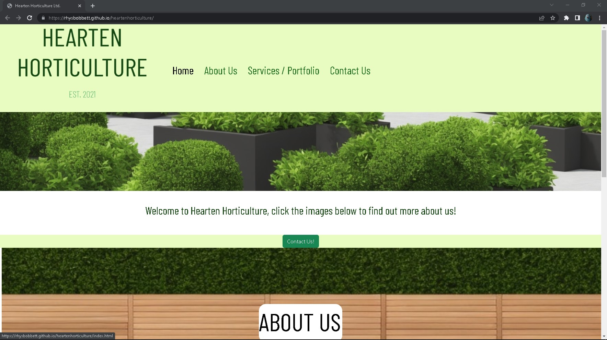 | No issues or errors on any page |
[Mozilla Firefox Developer Edition](https://www.mozilla.org/en-GB/firefox/developer/) |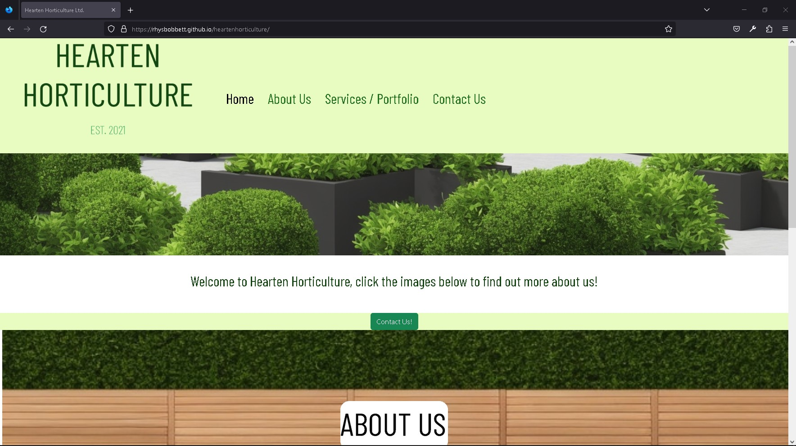 | No issues or errors on any page  |
[Microsoft Edge ](https://www.microsoft.com/en-gb/edge) |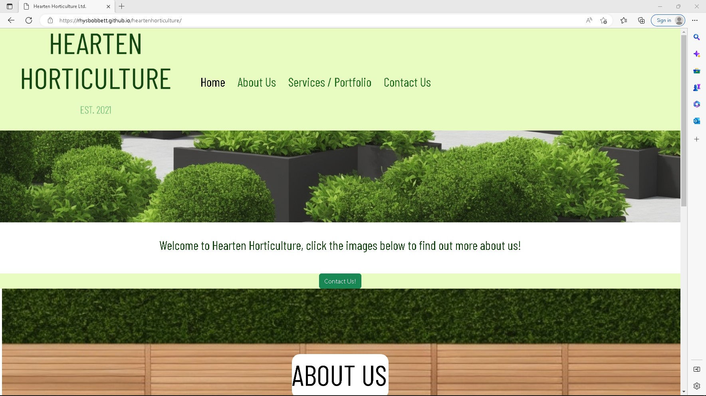 | No issues or errors on any page  |

## Accessibility testing
I tested the accesibility levels of the site using the [WAVE Web Accessibility Evaluation Tool](https://wave.webaim.org/)
The Alerts in the images are based on the tool deciding if something should be a heading where I didn't require it.
Here is a table of results for each page:
| Page | Screenshot | Pass / Notes |
| --- | --- | --- |
Index.html |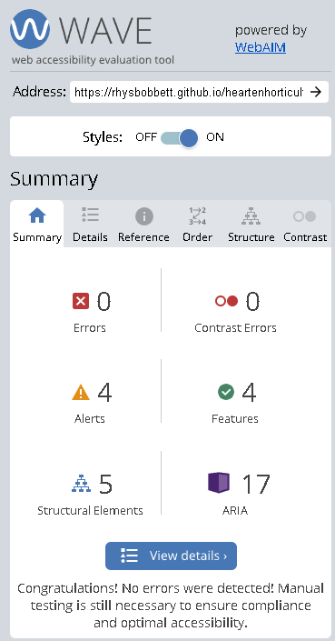 | No errors |
about.html |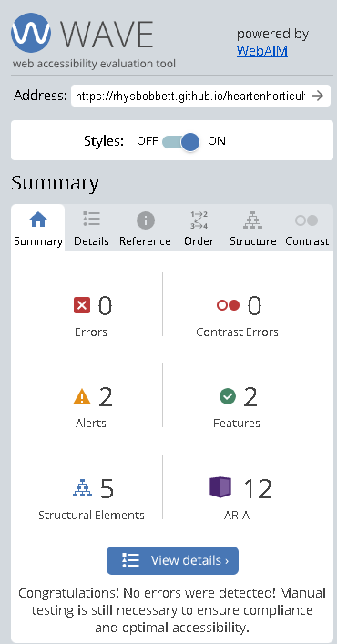 | No errors |
services.html | | No errors |
contactus.html |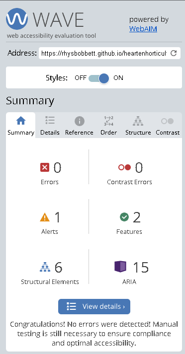 | No errors |
response.html | | No errors |
404.html | | No errors |

## Perfomance
Using lighthouse built into Google Chrome's developer tools, I was able to check the site's performance and optimise it for different criteria.
The criteria used in Lighthouse are Performance, Best Practices, Accessibility, Search Engine Optimisation and Progressive Web App.
The category of Progressive Web App is not met by any page as it doesn't meet the criteria.
 
During testing, I was able to amend my code to maximise the categories, my making sure all links are crawlable on the pages, I was able to achieve maximum rating for SEO.

Page | Screenshot | Format | Results / Notes
| --- | --- | --- | --- |
index.html |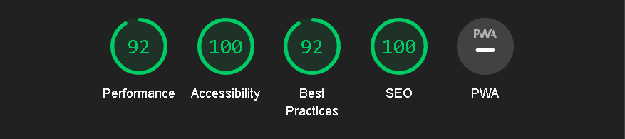 | Desktop | Pass, changing the logo and background image resolution would increase the performance of the page |
index.html | | Mobile | Pass, same as previous issue on desktop, the image could be too large to get a perfect score in performance speed. |
| | | |
about.html | | Desktop | Pass, my logo doesn't fit criteria of a standard aspect ratio, so this is marked down for Best Practice |
about.html |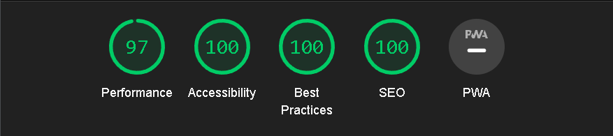 | Mobile | Pass, scoring slightly higher than desktop in Best Practice I believe is due to the variable ratios of mobile devices, performace slightly lower again due to the vector graphic logo |
| | | |
services.html |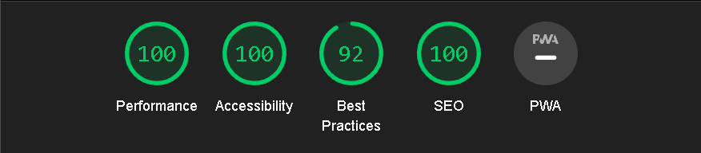 | Desktop | Pass, my logo doesn't fit criteria of a standard aspect ratio, so this is marked down on Best Practice |
services.html | | Mobile | Pass, the performance could be improved by resizing the image resolution in the portfolio gallery before upload. |
| | | |
contactus.html |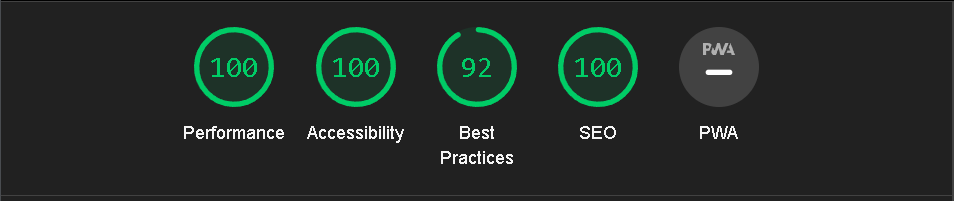 | Desktop | Pass, The mark of 92 for Best Practice relates to my logo being a non-standard aspect ratio  |
contactus.html |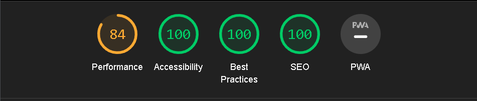 | Mobile | Pass, The low performace score refers to recomended use of render-blocking resources using javascript to defer loading certain parts of the page  |
| | | |
response.html |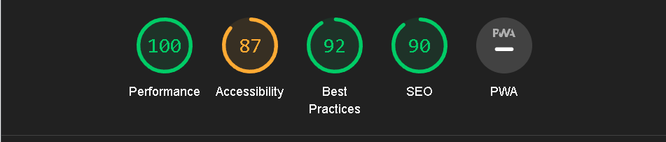 | Desktop | Pass, for all categories but accessibilty, as lighthouse suggests an automatic refresh after 10 seconds is unexpected and may create a confusing experience. I believe this is perfectly acceptable as there is no further functionality required of the user after seeing the submission response, they would instinctively navigate back to the homepage at their own accord if the feature was not implemented. |
response.html |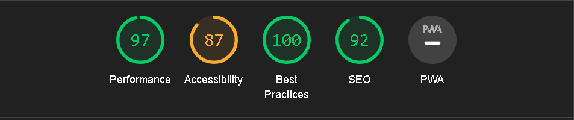 | Mobile | Pass, the large image brings the score of performace down. The same accessibility score as desktop is due to the automatic refresh.  |
| | | |
404.html |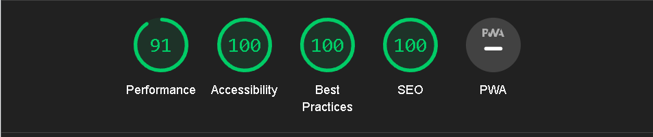 | Desktop | Pass, the large background needs the resolution to be changed if the page is to reach maximum performace score |
404.html | | Mobile | Pass, the large background needs the resolution to be changed if the page is to reach maximum performace score, it functions faster than desktop due to the width of the image not loading as intended.  |
| | | |

